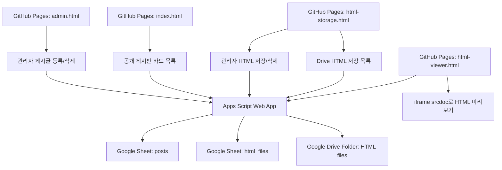

# 구조

## 역할

- `index.html`: 외부 방문자가 보는 공개 게시판입니다.
- `admin.html`: 관리자가 게시글을 등록/삭제합니다.
- `html-storage.html`: 관리자가 HTML 파일을 Drive에 저장/삭제합니다.
- Apps Script: 글 등록, 목록 불러오기, HTML 파일 저장을 처리합니다.
- Google Sheet `posts`: 게시판 카드 데이터를 저장합니다.
- Google Sheet `html_files`: Drive에 저장된 HTML 파일 목록을 저장합니다.
- Google Drive Folder: 실제 HTML 파일을 보관합니다.
- `html-viewer.html`: Drive 파일을 직접 공개하지 않고 Apps Script가 읽어온 HTML을 보여줍니다.

## URL 흐름

1. 사용자는 GitHub Pages 주소로 접속합니다.
2. 페이지에 Apps Script Web App URL을 한 번 입력합니다.
3. 목록 조회는 JSONP 방식으로 Apps Script에서 불러옵니다.
4. 등록/저장은 Apps Script `doPost`로 보냅니다.
5. Apps Script는 Google Sheet와 Google Drive에 저장합니다.
